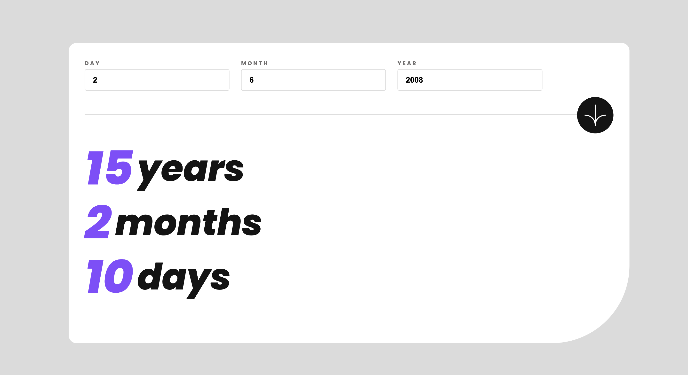

# Yaş Hesaplama Uygulaması

Bu basit web uygulaması, kullanıcının doğum tarihini girdiği zaman yaşını, ay farkını ve gün farkını hesaplar ve ekrana yazdırır.

## Özellikler

- Kullanıcı dostu arayüz.
- Mobil uyumlu.
- Doğru yaş hesaplamaları.
- Ay ve gün farklarını hesaplama.
- SCSS ile özelleştirilmiş görsel tasarım.
- Uygun değerlerin girilebilmesi için validasyon.

## Kullanılan Teknolojiler

- HTML
- CSS (SCSS)
- JavaScript

## Ekran Görüntüleri

## Nasıl Kullanılır

1. Projeyi klonlayın veya ZIP olarak indirin.
2. `index.html` dosyasını tarayıcınızda açın.
3. Doğum günü, ay ve yıl bilgilerini girin ve "Hesapla" butonuna tıklayın.
4. Uygulama yaşınızı, ay farkını ve gün farkını hesaplayacak ve ekrana yazdıracaktır.

## Katkıda Bulunma

1. Bu depoyu (repository) fork edin.
2. Yeni bir dal (branch) oluşturun: `git checkout -b yeni-ozellik`
3. Değişikliklerinizi yapın ve bunları commit edin: `git commit -m 'Yeni özellik eklendi'`
4. Dalınıza (branch) push yapın: `git push origin yeni-ozellik`
5. Bir Pull Request açın!

## Lisans

Bu proje MIT Lisansı altında lisanslanmıştır.
